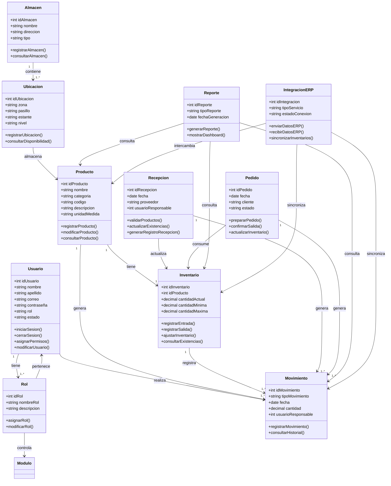

```mermaid
classDiagram
class Usuario {
 +int idUsuario
 +string nombre
 +string apellido
 +string correo
 +string contraseña
 +string rol
 +string estado
 +iniciarSesion()
 +cerrarSesion()
 +asignarPermisos()
 +modificarUsuario()
}
class Rol {
 +int idRol
 +string nombreRol
 +string descripcion
 +asignarRol()
 +modificarRol()
}
class Producto {
 +int idProducto
 +string nombre
 +string categoria
 +string codigo
 +string descripcion
 +string unidadMedida
 +registrarProducto()
 +modificarProducto()
 +consultarProducto()
}
class Inventario {
 +int idInventario
 +int idProducto
 +decimal cantidadActual
 +decimal cantidadMinima
 +decimal cantidadMaxima
 +registrarEntrada()
 +registrarSalida()
 +ajustarInventario()
 +consultarExistencias()
}
class Movimiento {
 +int idMovimiento
 +string tipoMovimiento
 +date fecha
 +decimal cantidad
 +int usuarioResponsable
 +registrarMovimiento()
 +consultarHistorial()
}
class Almacen {
 +int idAlmacen
 +string nombre
 +string direccion
 +string tipo
 +registrarAlmacen()
 +consultarAlmacen()
}
class Ubicacion {
 +int idUbicacion
 +string zona
 +string pasillo
 +string estante
 +string nivel
 +registrarUbicacion()
 +consultarDisponibilidad()
}
class Recepcion {
 +int idRecepcion
 +date fecha
 +string proveedor
 +int usuarioResponsable
 +validarProductos()
 +actualizarExistencias()
 +generarRegistroRecepcion()
}
class Pedido {
 +int idPedido
 +date fecha
 +string cliente
 +string estado
 +prepararPedido()
 +confirmarSalida()
 +actualizarInventario()
}
class Reporte {
 +int idReporte
 +string tipoReporte
 +date fechaGeneracion
 +generarReporte()
 +mostrarDashboard()
}
class IntegracionERP {
 +int idIntegracion
 +string tipoServicio
 +string estadoConexion
 +enviarDatosERP()
 +recibirDatosERP()
 +sincronizarInventarios()
}
Usuario "1" --> "1..*" Rol : tiene
Usuario --> Movimiento : realiza
Rol --> Usuario : pertenece
Rol --> Modulo : controla
Almacen "1" --> "1..*" Ubicacion : contiene
Ubicacion --> Producto : almacena
Producto "1" --> "1" Inventario : tiene
Producto "1" --> "1..*" Movimiento : genera
Inventario "1" --> "1..*" Movimiento : registra
Recepcion "1" --> "1..*" Movimiento : genera
Recepcion --> Inventario : actualiza
Pedido "1" --> "1..*" Movimiento : genera
Pedido --> Inventario : consume
Reporte --> Inventario : consulta
Reporte --> Movimiento : consulta
Reporte --> Producto : consulta
IntegracionERP --> Inventario : sincroniza
IntegracionERP --> Movimiento : sincroniza
IntegracionERP --> Producto : intercambia
class Modulo
```
